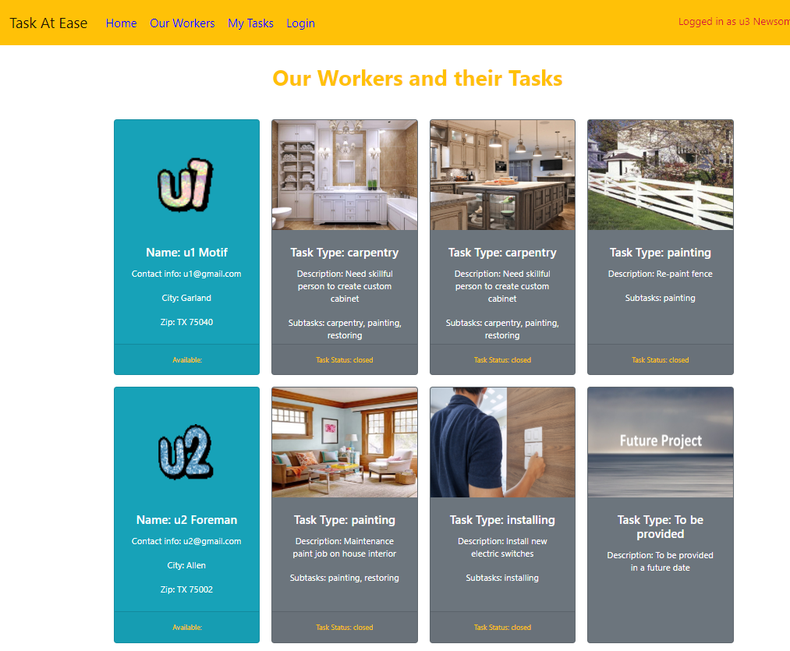
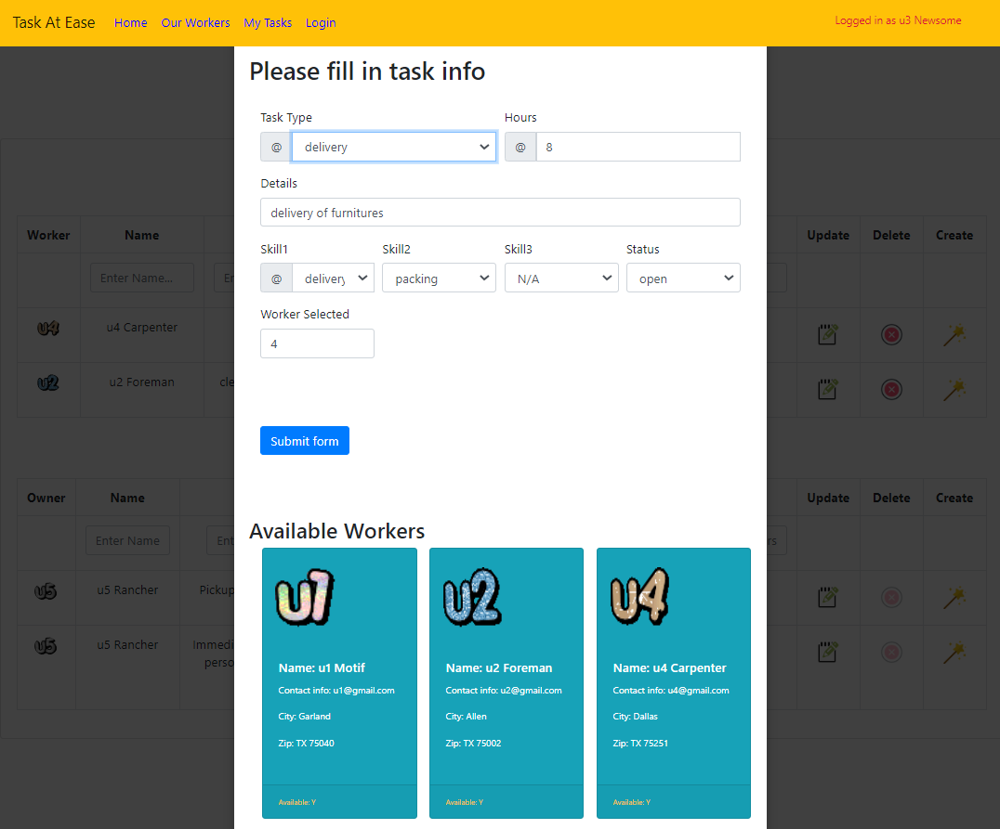

# task-at-ease-frontend
#
# Description
### Provide an online market place for house owners and workers to create and manage house tasks. A house owner can create tasks. Workers can use contact info to directly contact house owners. A worker can accept a task invite. A owner or worker can close the task upon completion.
# 
# Target users
### House owners who are looking to hire workers to help with house chores. Workers who are looking to take on house tasks.
# 
# Screens
### Home page

### Home grid - Open task alert on left. Sample tasks on right

### Our workers - Introduction of workers and past tasks

### Login - login form for authentication using Postgres

### My tasks - Tasks opened, being worked on, completed by the logged in user

### Task form - form to create new tasks or update an existing task

# 
# Components
### Stateful components
#### App.js - Nav bar. Carousel. Home grid
#### OpenTaskAlert - Open task msg on left pane of Home grid.
#### Login.js - Login and autheticate
#### OurWorkers.js - List of workers and photo's of past task
#### MyTasks.js - Task creation, read, update, delete.
#### TaskForm.js - Form for task creation and update
# 
### Functional components
#### Home.js - landing page with rendering shown App.js
#### SlideTop.js - graphic on top part of landing page to introduce the purpose of the web site
#### TaskCardList.js - display list of task summary cards for MyWorkers and task details cards for MyTasks
#### UserCard.js - display user info in a card
#### WorkerTaskCard.js - Display list of past tasks for each worker
# 
# API used: 
### 1) Current location zip code lookup:
##### https://api.ipify.org
##### https://api.ipgeolocation.io/ipgeo
### 2) Zip codes within distance of current location
##### https://www.zipcodeapi.com/rest
##### Prior free API has expired. New API from zipcodeapi.com has a limit 10 request/hr, 240 request/day.
# 
# Baseline Technologies
### Frontend: Reactjs, React Router, Axios/AJAX
### Backend: 5 API models. Spring Boot w/ Maven as build tool, MVC architecture, Postgres SQL database
#
# Technologies used additionally
### React Bootstrap, Bootstrap
### Express.js server backend as image file server 
### Authentication using Postgres
### React-slideshow to graphically illustrate the business concept in home page
### Axios for API calls
### Animation libraries in home page to grab attention
# 
# CRUD operations
### Create, Read, Update, Delete on tasks table  
### Read from users, workerskills, tasks, taskphoto, skills
#
# Installation
#
##### npm install react-slideshow-image --sav
##### npm install --sav radium 
#
##### npm install react-bootstrap bootstrap --sav
#
##### npm install react-router-dom --sav
# 
##### npm install axios --sav
#
# Heroku deploy links 
### (Please note that it takes a couple minutes to wake up processes on Heroku and complete initial rendering):
###### Frontend: https://task-at-ease-frontend.netlify.app   
###### DB Backend: https://task-at-ease-backend.herokuapp.com   
###### Img Server:https://task-at-ease-img-svr.herokuapp.com   